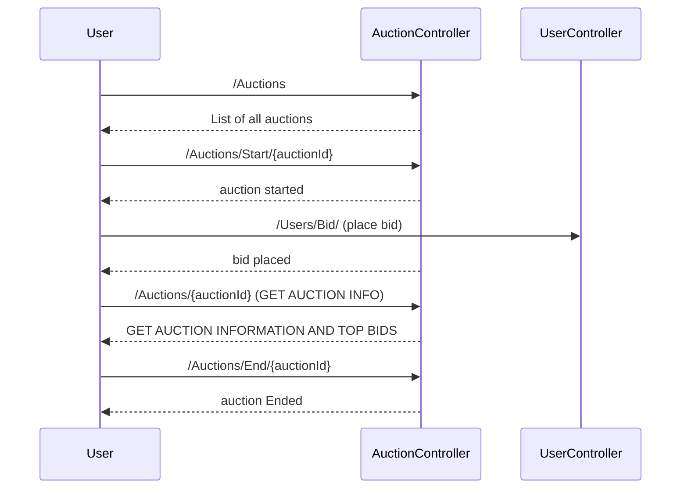

# Software Developer Coding Challenge

## Build Status


  

  

# App url

https://car-auction.herokuapp.com/

# Steps to run locally

```sh
$ git clone https://github.com/lucklypriyansh/software-developer-coding-challenge.git
$ cd software-developer-coding-challenge
$ ./mvnw clean install
$ ./mvnw spring-boot:run
```

## URL
> https://car-auction.herokuapp.com/swagger-ui.html


## UML diagrams

Sequence Diagram for auction flow


